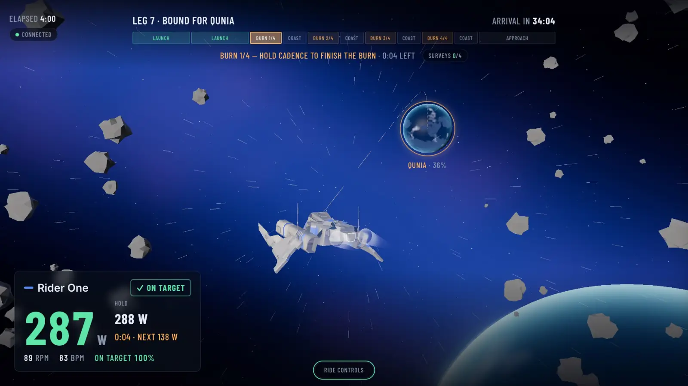
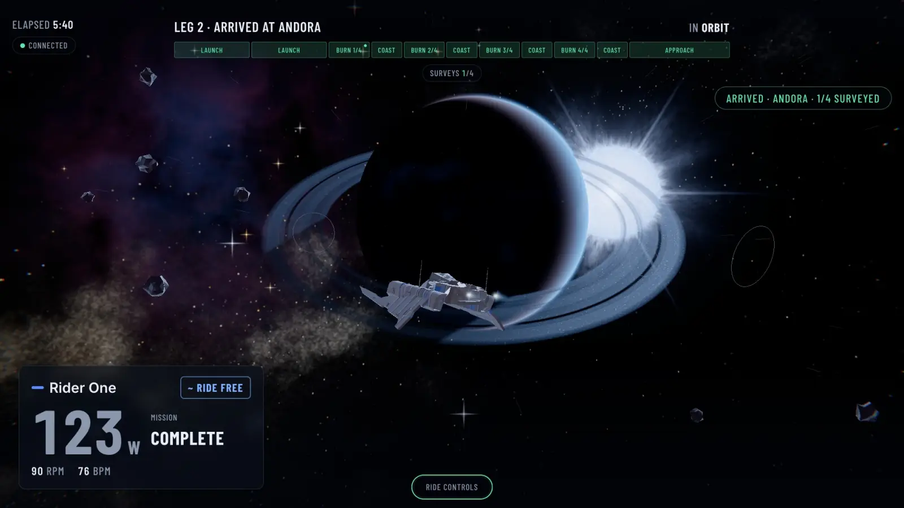
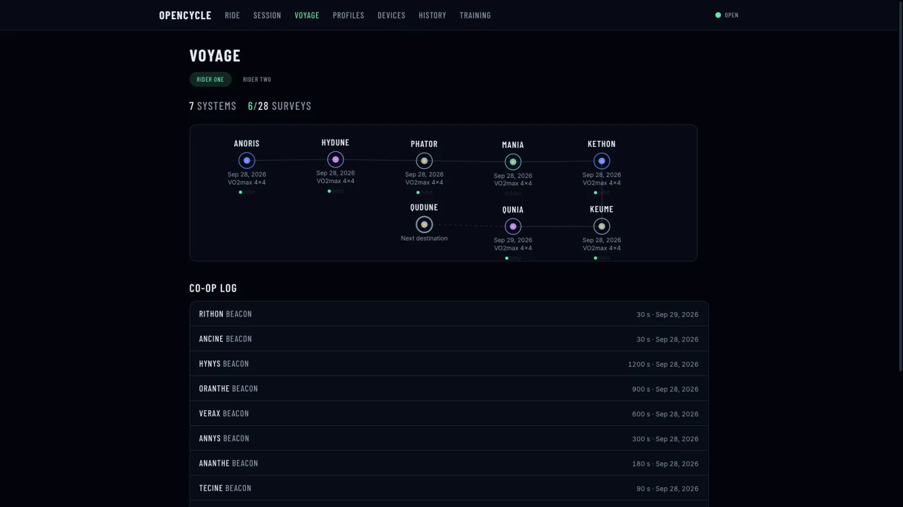

# openCycle

I built my own indoor cycling app. It holds my Wahoo KICKR at the watts the workout asks for, records every ride as a FIT file and uploads it to Garmin. It also lets more than one of us ride on the same computer. While you ride, the workout flies a small fleet of ships to a new star system.

It replaced the subscription app I was paying for. It's MIT licensed.

Site: https://opencycle.pages.dev



## The voyage

Every workout is a flight to a new star system. I wanted it to look like Interstellar and fly like Elite Dangerous. So every system has something huge in it: a black hole bending the starlight around it, a blue supergiant, or two stars orbiting each other. Each session opens with a jump through hyperspace.

- **The workout is the mission clock.** You get there by finishing the workout. How hard you push changes what you find when you arrive. It never decides whether you arrive.
- **Legs.** The workout is split into legs: launch, cruise, climb, burn, coast and approach. Intervals become burns. The sidebar on the left lists every leg and shows where you are in the workout.
- **Surveys.** Every cruise, climb and burn leg is a survey chance. Stay within 10% of the target for 85% of the leg and the survey locks. When you arrive, each locked survey lights up a ring, a moon or a station. Going over target doesn't count.
- **Pursuits.** Every burn is a chase. A raider warps in ahead of you, and while you're on target your ship shoots at it and the lock fills. Finish the burn clean and it goes down. Miss it and it gets away. Nobody takes damage.
- **Your voyage.** Each rider has a star map of every system they've reached. The next stop is already picked, so a planned workout already has a destination.
- **Riding together.** Everyone flies to the same destination and chases the same raider. Hold your zones together and a tether links the ships. If someone's cadence drops, someone else can cover by riding 10% over their own target for fifteen seconds.
- **Free rides** just cruise open space.

The game only reads the trainer and the workout. It never changes your targets, and the FIT file is the same either way.





## Hardware

- **Trainer:** I've only tested it on my own Wahoo KICKR CORE, over Bluetooth FTMS ERG. Other FTMS trainers might work. I just haven't tried one.
- **Heart rate:** any Bluetooth strap that uses the standard Heart Rate Service.
- **Computer:** macOS and Node 24. The Bluetooth library is a native addon, so the server needs Node. Bun won't run it.

## Try it

You don't need a trainer. The simulator fakes two trainers and two heart rate straps.

```bash
pnpm install
pnpm demo
```

That builds the app, starts it on http://localhost:4000 and opens your browser. Create a profile, pick a workout and start a session. The demo keeps its data in a temp folder, so it won't touch real rides.

You need Node 24 and pnpm 10.26 or later. The repo pins pnpm through `packageManager`.

## The Mac app

```bash
pnpm app
```

This builds `openCycle.app` into `~/Applications`. Open it and allow Bluetooth once when macOS asks. It starts the server, opens the browser and puts an openCycle item in the menu bar with Open, Show logs and Quit.

A few things worth knowing:

- Quitting finishes any ride in progress first, so the FIT file is saved.
- Logs are in `~/Library/Logs/openCycle/server.log`. If the server crashes, the app shows the last lines.
- The app runs the code from this folder. After you pull changes, run `pnpm app` again. If you move the folder, rebuild.
- Each rebuild re-signs the app, so macOS might ask for Bluetooth again. Say yes and it sticks.
- To run a one-off command with the app's Bluetooth permission, like the Garmin login: `open -a openCycle --args --exec "pnpm garmin:login --rider <id>"`.

`pnpm app` options: `--sim` (simulator, no Bluetooth), `--out <dir>`, `--data-dir <path>`, `--no-build`.

The app exists because macOS won't give Bluetooth to a process started from a terminal over SSH, or to anything without an app bundle. The permission belongs to the app, and the server it starts inherits it.

## Any other computer

```bash
pnpm start
```

It builds the UI if needed and serves everything on port 4000. Add `--ble` (`pnpm start --ble`) to scan for real Bluetooth devices.

For development:

```bash
pnpm dev        # server on :4000, Vite with hot reload on :5173
pnpm dev:server # server only
pnpm build      # build the web UI into apps/web/dist
pnpm check      # type-check every package
pnpm test       # run the tests
```

## Network and security

The server listens on your whole network, so a TV or tablet can show the ride at `http://<your-mac's-ip>:4000`. There's nothing to set up for that. `OPENCYCLE_HOST=127.0.0.1` keeps it on this computer.

> **There's no login.** Anyone who can reach the server can start sessions, change profiles and read ride data. Run it on a home network you trust. Don't put it on the internet.

Rides and profiles live in `~/.opencycle`. Set `OPENCYCLE_DATA_DIR` to put them somewhere else.

## What's in the repo

- `packages/shared`: schemas and types, the Bluetooth protocol constants, physics, the training load model and the voyage rules
- `apps/server`: the Node server (Bluetooth, sessions, ERG, the FIT recorder, the API, Garmin sync and training plans)
- `apps/web`: the React and three.js app
- `packaging/macos`: the Mac app launcher and icon
- `assets/ships`: the Blender pipeline that finishes the ship models
- `data/plans`: workouts and plan templates
- `skills/workout-author`: a Claude skill for writing workouts and plans
- `docs`: the game design and the Bluetooth protocol notes

## Writing workouts

Workouts are JSON in `data/plans/*.json`, and multi-week plan templates are in `data/plans/templates/*.json`. The schemas and zone conventions are in `skills/workout-author/SKILL.md`. Check a file or the whole folder with:

```bash
pnpm workout:validate data/plans
```

It checks every workout and template against the schemas, and that every workout a template uses exists. Exit 0 means the server will load them.

The authoring skill ships in the repo. Symlink it so Claude Code picks it up:

```bash
ln -s "$(pwd)/skills/workout-author" ~/.claude/skills/workout-author
```

## Garmin sync

**Importing old rides.** Drop a Garmin account-export ZIP or loose `.fit` files into `~/.opencycle/import/`.

- Put them in `import/<riderId>/` to import them for that rider. The folder name has to be an existing profile id.
- Files at the top level stay unassigned until you assign them in History.
- A file that imported something moves to `import/done/`, with a `.err.txt` next to it if some rides failed. A file that imported nothing moves to `import/failed/`.
- You can also upload a ZIP from the app, or `POST /api/garmin/import-zip?riderId=<id>`. Imports are refused while a session is running.
- `POST /api/garmin/pull/:riderId` pulls the rider's last 30 days from Garmin in the background.
- If you import the same export twice, pick the rider in the import screen so it skips rides it already has. Unassigned re-imports make duplicates.

**Uploading rides.** Finished rides upload to Garmin Connect on their own when the rider's profile has auto-upload on and a saved login exists. If an upload fails, History shows the reason and a retry button. Garmin changes their login flow without warning, and when they do, uploads fail until this part gets fixed. It's kept separate so nothing else breaks with it.

Log in once per rider:

```bash
pnpm garmin:login --rider <profile-id>
```

A browser opens. Sign in and do the MFA by hand. The login is saved to `~/.opencycle/garmin/<riderId>.json`, never the database, and profiles don't store passwords. Running it again replaces it.

## Credits

- Ship base meshes: [Ultimate Spaceships Pack](https://quaternius.com/packs/ultimatespaceships.html) by Quaternius (CC0), re-finished for openCycle.
- Fonts: Barlow Condensed and Inter (SIL Open Font License), self-hosted through Fontsource.

## License

MIT. See [LICENSE](LICENSE).
